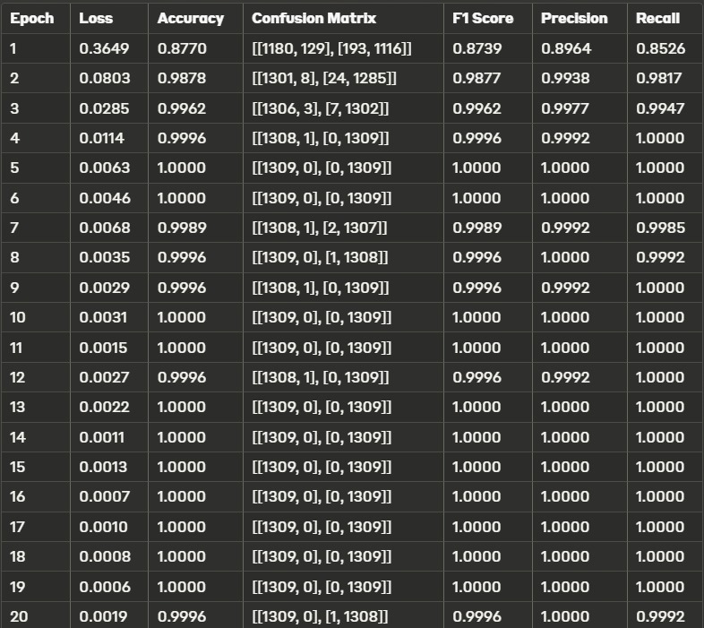
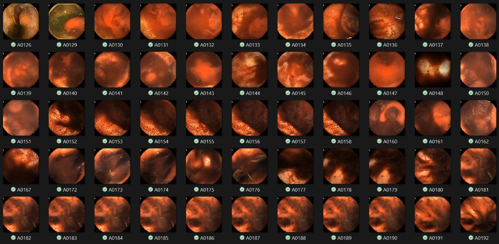
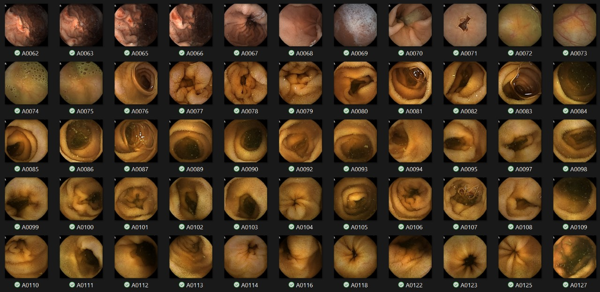
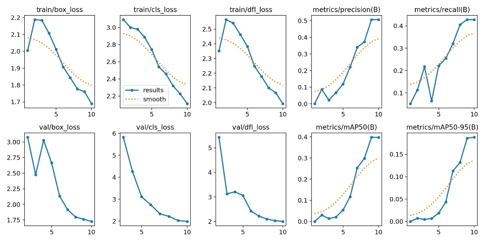
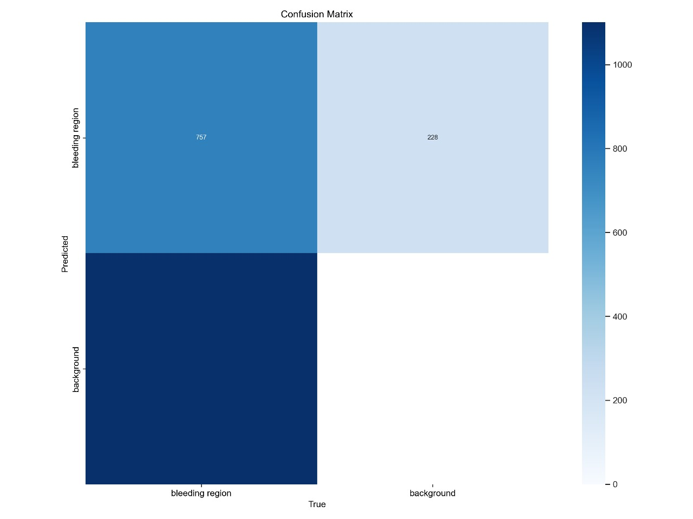
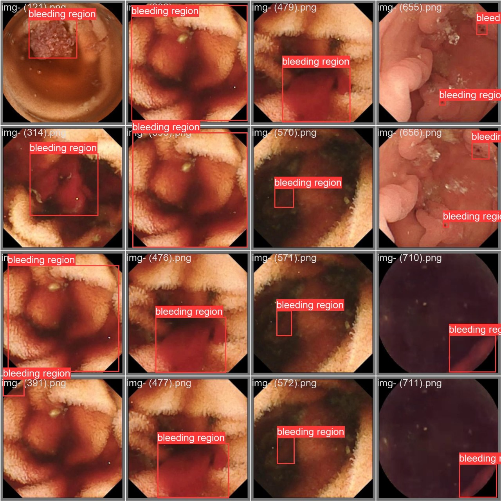
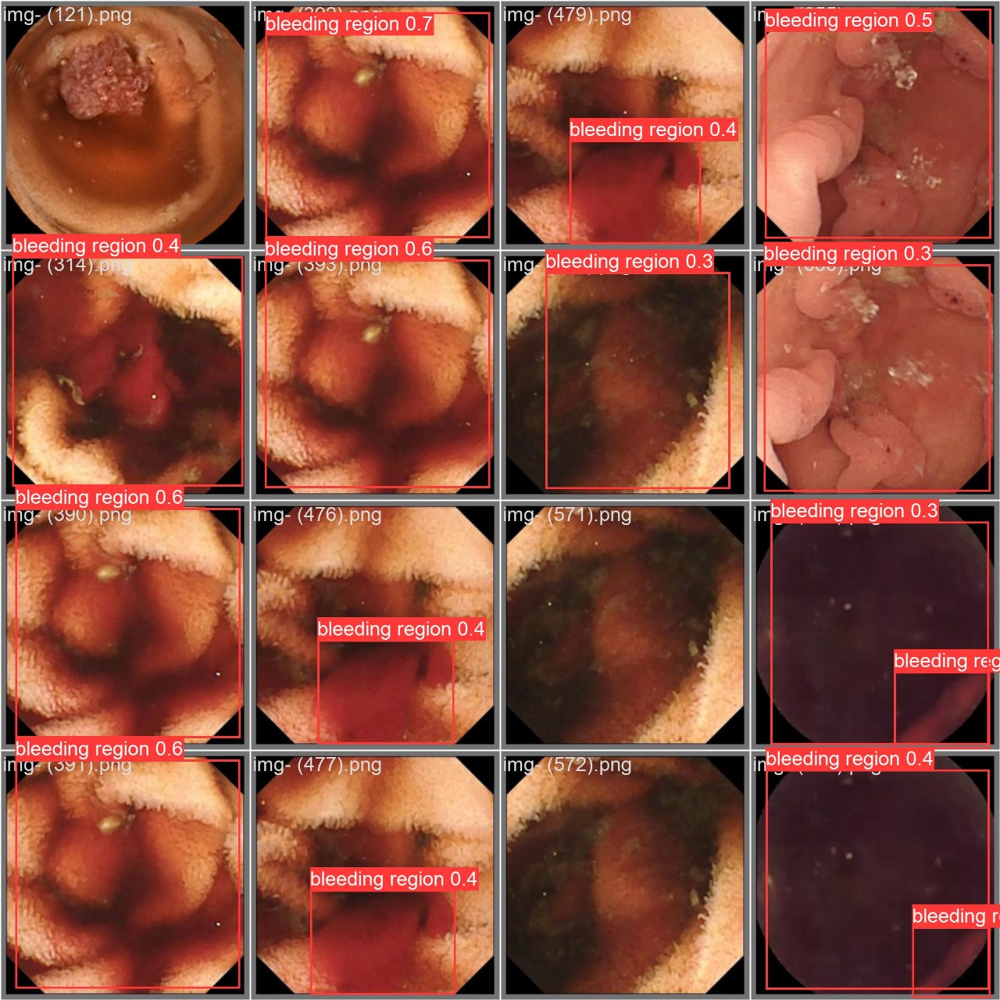

# Classifcation of Bleeding and Non-Bleeding frames and further Detection of the Bleeding Region

This project aims to develop a system for detecting and localizing bleeding regions in wireless capsule endoscopy (WCE) images. The system consists of two main tasks: classification and detection.

## Table of Contents

- [Dataset](#dataset)
- [Classification Task](#classification-task)
  - [Hyperparameter Tuning](#hyperparameter-tuning)
  - [Training the Classification Model](#training-the-classification-model)
  - [Testing the Classification Model](#testing-the-classification-model)
  - [Results of Classification](#results-of-classification)

- [Detection Task](#detection-task)
  - [Model Training](#model-training)
  - [Model Validation](#model-validation)
  - [Model Prediction](#model-prediction)
  - [Results of Detection](#results-of-detection)

## (Note: Make changes to paths wherever necessary)

## Dataset

The dataset used in this project is the `WCEBleedGen_dataset`, which contains two folders:

- `bleeding`: This folder contains all the bleeding images and their corresponding annotations and bounding box files.
- `non-bleeding`: This folder contains all the non-bleeding images.

## Classification Task

The classification task involves training a model to classify WCE images as either "bleeding" or "non-bleeding".

### Hyperparameter Tuning

The `Final_Code.ipynb` notebook includes a section for hyperparameter tuning using the ResNet50 model. The hyperparameters considered are learning rate, batch size, number of epochs, and optimizer type. A random search is performed to find the best combination of hyperparameters based on the accuracy and training time.

### Training the Classification Model

After tuning the hyperparameters, the ResNet50 model is trained on the complete training dataset using the optimal hyperparameters. The training loop includes evaluation metrics such as confusion matrix, F1-score, precision, recall, accuracy, and ROC-AUC. The trained model is saved as `model50_with_hyperparameter.pth`.

### Testing the Classification Model

The trained model is tested on an unseen dataset (`Test Dataset 2`). The images are classified as "Bleeding" or "Non-Bleeding", and the predictions are stored in separate folders (`Predicted_Bleeding_Images` and `Predicted_Non_Bleeding_Images`).

## Results of Classification
### Evaluation Metrics

### Predicted_Classification Bleeding

### Predicted_Classification Non-Bleeding

## Detection Task

The detection task involves training a model to localize and detect bleeding regions in WCE images.

### Model Training

The YOLOv8 model is trained for object detection using the `yolo detect` command from the Ultralytics library. The training data is specified in the `data.yaml` file, and the training is performed for 10 epochs with a learning rate of 0.001. The training results, including the confusion matrix and performance plots, are saved in the `runs/detect/train4` directory.

### Model Validation

After training, the model is validated using the `yolo task=detect mode=val` command. The validation results, including predicted images, are saved in the `runs/detect/val3` directory.

### Model Prediction

The trained model is used to predict and localize bleeding regions in the previously classified "Bleeding" images from the classification task. The predictions are saved as images and text files in the `runs/detect/predict5` directory.

## Results of Detection:
### Results

#### Confusion_Matrix

#### Bleed_actual_Val_Detection

#### Bleed_pred_Val_Detection

## Usage

To run the code, follow these steps:

1. Install the required dependencies, including PyTorch, Ultralytics, and other necessary libraries.
2. Ensure that the dataset is properly organized and the paths in the `data.yaml` file are correct.
3. Run the classification task by executing the relevant cells in the `Final_Code.ipynb` notebook.
4. Run the detection task by executing the appropriate cells for training, validation, and prediction.

Note: The notebook assumes that you have a GPU available for training and inference. If you don't have a GPU, you may need to modify the code accordingly.

## Acknowledgments

This project was developed as part of the Machine Learning course at RV University.

We would like to acknowledge the following resources:

- [YOLOv8 Documentation](https://docs.ultralytics.com/modes/predict/#inference-arguments)
- [Resnet50 Documentation](https://pytorch.org/vision/main/models/generated/torchvision.models.resnet50.html)
- [YOLOv8 Training Notebook](https://github.com/Shivam-027/Auto-WCEBleedGen-Challenge/blob/main/MODEL/Training_YOLOv8.ipynb) Yolov8 code snippets
- [Training Dataset](https://zenodo.org/records/10156571)
- [Testing Dataset](https://zenodo.org/records/10124589)
- [MISAHub Challenge](https://misahub.in/CVIP/challenge.html)
